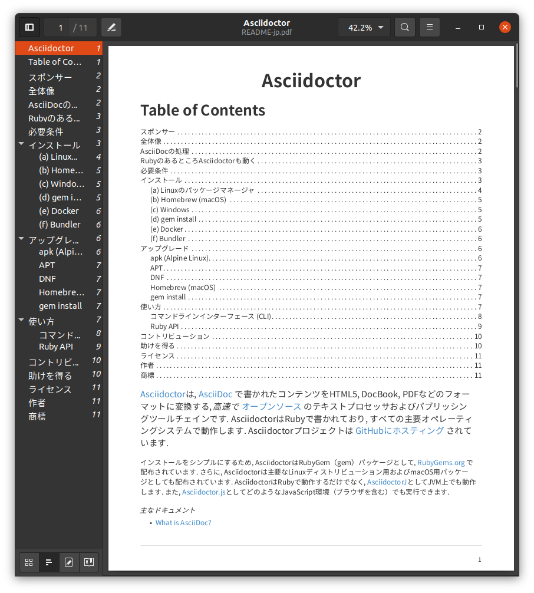
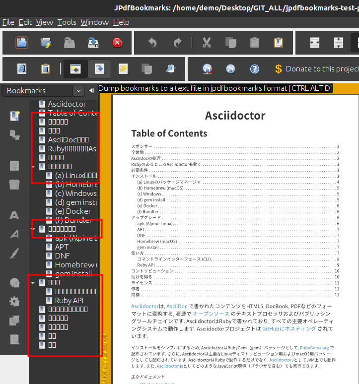
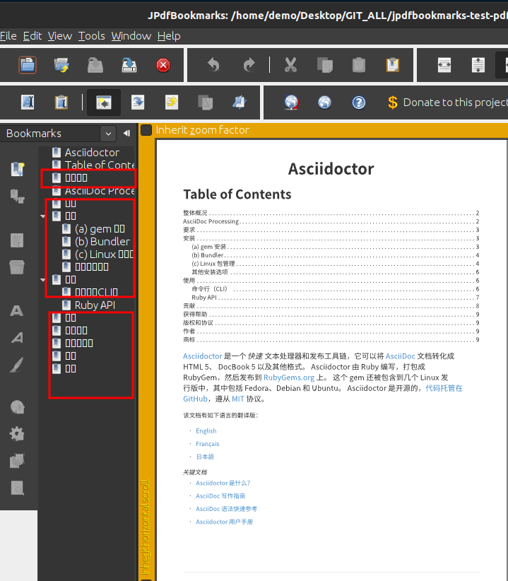
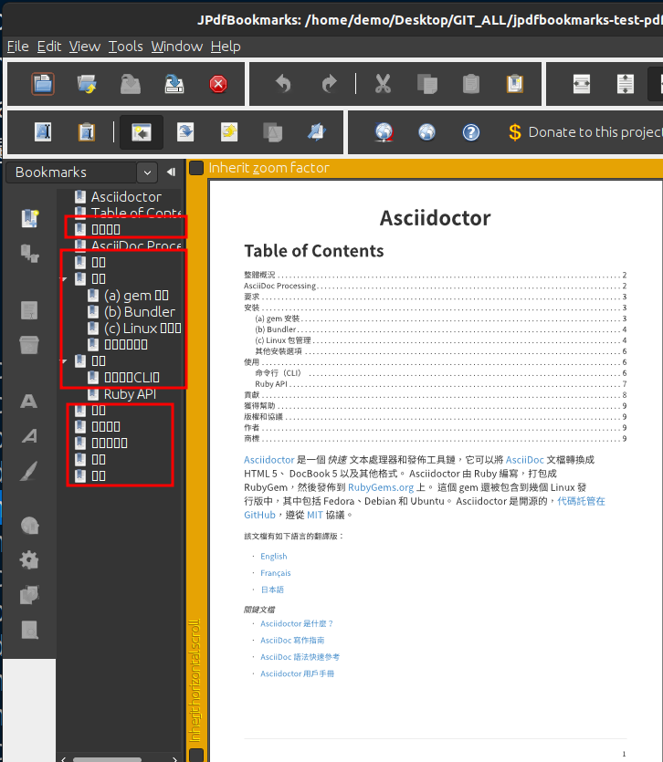
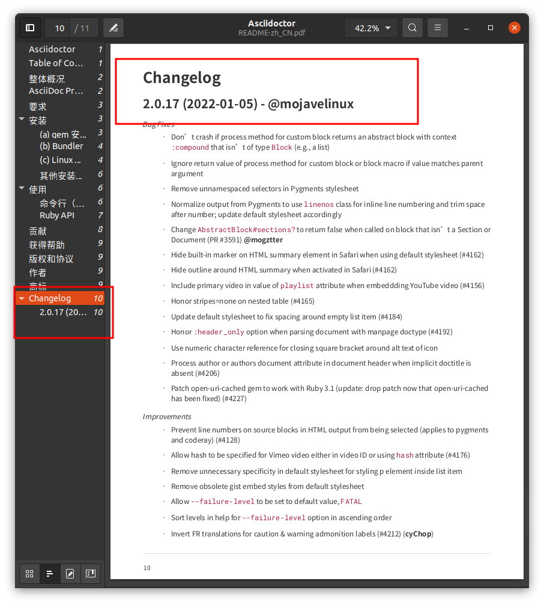
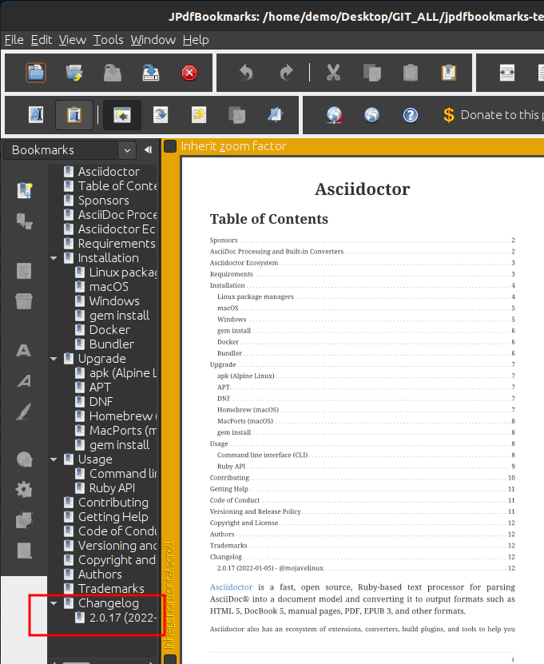

= jpdfbookmarks-test-reports
life888888
:doctype: article
:encoding: utf-8
:lang: en
:toc: left
:numbered:
:experimental:

Baseline PDF test results against jpdfbookmarks are listed in this document. 

== Testing PDF file list 

[source,bash]
----
asciidoctor-pdf-cjk-examples/target
├── generated-docs
│   ├── README-jp.pdf
│   ├── README.pdf
│   ├── README-zh_CN.pdf
│   └── README-zh_TW.pdf
├── generated-docs-compress
│   ├── README-jp.pdf
│   ├── README.pdf
│   ├── README-zh_CN.pdf
│   └── README-zh_TW.pdf
├── generated-docs-compress-include
│   ├── README-jp.pdf
│   ├── README.pdf
│   ├── README-zh_CN.pdf
│   └── README-zh_TW.pdf
└── generated-docs-include
    ├── README-jp.pdf
    ├── README.pdf
    ├── README-zh_CN.pdf
    └── README-zh_TW.pdf
----

== JPdfBookmarks 2.5.2 Test Results

.Open PDF using gui mode of jpdfbookmarks 2.5.2
[source,bash]
----
$ jpdfbookmarks generated-docs-AAA/README_BB.pdf
----

Please replace generated-docs-AAA above with something like:

* generated-docs
* generated-docs-compress
* generated-docs-include
* generated-docs-compress-include

Please replace the above README_BB.pdf with something like:

* README.pdf
* README-jp.pdf
* README-zh_CN.pdf
* README-zh_TW.pdf

.generated-docs / generated-docs-compress
[caption='{table-caption} {counter:table-number}']
[%header]
|===
|File Name|Is GUI Bookmarks displayed normally?|Whether the console is normal and no error message is output?
|README-jp.pdf|Unable to display CJK characters, become tofu characters|success
|README-zh_CN.pdf|Unable to display CJK characters, become tofu characters|success
|README-zh_TW.pdf|Unable to display CJK characters, become tofu characters|success
|README.pdf|success|success
|===

.generated-docs-include / generated-docs-compress-include
[caption='{table-caption} {counter:table-number}']
[%header]
|===
|File Name|Is GUI Bookmarks displayed normally?|Whether the console is normal and no error message is output?
|README-jp.pdf|Unable to display CJK characters, become tofu characters|success
|README-zh_CN.pdf|Unable to display CJK characters, become tofu characters|success
|README-zh_TW.pdf|Unable to display CJK characters, become tofu characters|success
|README.pdf|success|An error message is generated in Console/Terminal. 
|===

.The error message is shown below
[source,bash]
----
$ jpdfbookmarks generated-docs-include/README.pdf

java.lang.ArrayIndexOutOfBoundsException: 120
	at org.jpedal.fonts.tt.FontFile2.getNextUint8(Unknown Source)
	at org.jpedal.fonts.tt.TTGlyph.readSimpleGlyph(Unknown Source)
	at org.jpedal.fonts.tt.TTGlyph.readGlyph(Unknown Source)
	at org.jpedal.fonts.tt.TTGlyph.<init>(Unknown Source)
	at org.jpedal.fonts.tt.TTGlyphs.getTTGlyph(Unknown Source)
	at org.jpedal.fonts.tt.TTGlyphs.getEmbeddedGlyph(Unknown Source)
	at org.jpedal.parser.PdfStreamDecoder.processTextArray(Unknown Source)
	at org.jpedal.parser.PdfStreamDecoder.TJ(Unknown Source)
	at org.jpedal.parser.PdfStreamDecoder.processToken(Unknown Source)
	at org.jpedal.parser.PdfStreamDecoder.decodeStreamIntoObjects(Unknown Source)
	at org.jpedal.parser.PdfStreamDecoder.decodeStreamIntoObjects(Unknown Source)
	at org.jpedal.parser.PdfStreamDecoder.decodePageContent(Unknown Source)
	at org.jpedal.ThumbnailDecoder.getPageAsThumbnail(Unknown Source)
	at org.jpedal.examples.simpleviewer.gui.swing.SwingThumbnailPanel$3.construct(Unknown Source)
	at org.jpedal.utils.SwingWorker$2.run(Unknown Source)
	at java.lang.Thread.run(Thread.java:748)
java.lang.ArrayIndexOutOfBoundsException: 120
	at org.jpedal.fonts.tt.FontFile2.getNextUint16(Unknown Source)
	at org.jpedal.fonts.tt.TTGlyph.readSimpleGlyph(Unknown Source)
	at org.jpedal.fonts.tt.TTGlyph.readGlyph(Unknown Source)
	at org.jpedal.fonts.tt.TTGlyph.<init>(Unknown Source)
	at org.jpedal.fonts.tt.TTGlyphs.getTTGlyph(Unknown Source)
	at org.jpedal.fonts.tt.TTGlyphs.getEmbeddedGlyph(Unknown Source)
	at org.jpedal.parser.PdfStreamDecoder.processTextArray(Unknown Source)
	at org.jpedal.parser.PdfStreamDecoder.TJ(Unknown Source)
	at org.jpedal.parser.PdfStreamDecoder.processToken(Unknown Source)
	at org.jpedal.parser.PdfStreamDecoder.decodeStreamIntoObjects(Unknown Source)
	at org.jpedal.parser.PdfStreamDecoder.decodeStreamIntoObjects(Unknown Source)
	at org.jpedal.parser.PdfStreamDecoder.decodePageContent(Unknown Source)
	at org.jpedal.ThumbnailDecoder.getPageAsThumbnail(Unknown Source)
	at org.jpedal.examples.simpleviewer.gui.swing.SwingThumbnailPanel$3.construct(Unknown Source)
	at org.jpedal.utils.SwingWorker$2.run(Unknown Source)
	at java.lang.Thread.run(Thread.java:748)
java.lang.ArrayIndexOutOfBoundsException: 120
	at org.jpedal.fonts.tt.FontFile2.getNextUint16(Unknown Source)
	at org.jpedal.fonts.tt.TTGlyph.readSimpleGlyph(Unknown Source)
	at org.jpedal.fonts.tt.TTGlyph.readGlyph(Unknown Source)
	at org.jpedal.fonts.tt.TTGlyph.<init>(Unknown Source)
	at org.jpedal.fonts.tt.TTGlyphs.getTTGlyph(Unknown Source)
	at org.jpedal.fonts.tt.TTGlyphs.getEmbeddedGlyph(Unknown Source)
	at org.jpedal.parser.PdfStreamDecoder.processTextArray(Unknown Source)
	at org.jpedal.parser.PdfStreamDecoder.TJ(Unknown Source)
	at org.jpedal.parser.PdfStreamDecoder.processToken(Unknown Source)
	at org.jpedal.parser.PdfStreamDecoder.decodeStreamIntoObjects(Unknown Source)
	at org.jpedal.parser.PdfStreamDecoder.decodeStreamIntoObjects(Unknown Source)
	at org.jpedal.parser.PdfStreamDecoder.decodePageContent(Unknown Source)
	at org.jpedal.ThumbnailDecoder.getPageAsThumbnail(Unknown Source)
	at org.jpedal.examples.simpleviewer.gui.swing.SwingThumbnailPanel$3.construct(Unknown Source)
	at org.jpedal.utils.SwingWorker$2.run(Unknown Source)
	at java.lang.Thread.run(Thread.java:748)
java.lang.ArrayIndexOutOfBoundsException: 120
	at org.jpedal.fonts.tt.FontFile2.getNextUint16(Unknown Source)
	at org.jpedal.fonts.tt.TTGlyph.readSimpleGlyph(Unknown Source)
	at org.jpedal.fonts.tt.TTGlyph.readGlyph(Unknown Source)
	at org.jpedal.fonts.tt.TTGlyph.<init>(Unknown Source)
	at org.jpedal.fonts.tt.TTGlyphs.getTTGlyph(Unknown Source)
	at org.jpedal.fonts.tt.TTGlyphs.getEmbeddedGlyph(Unknown Source)
	at org.jpedal.parser.PdfStreamDecoder.processTextArray(Unknown Source)
	at org.jpedal.parser.PdfStreamDecoder.TJ(Unknown Source)
	at org.jpedal.parser.PdfStreamDecoder.processToken(Unknown Source)
	at org.jpedal.parser.PdfStreamDecoder.decodeStreamIntoObjects(Unknown Source)
	at org.jpedal.parser.PdfStreamDecoder.decodeStreamIntoObjects(Unknown Source)
	at org.jpedal.parser.PdfStreamDecoder.decodePageContent(Unknown Source)
	at org.jpedal.ThumbnailDecoder.getPageAsThumbnail(Unknown Source)
	at org.jpedal.examples.simpleviewer.gui.swing.SwingThumbnailPanel$3.construct(Unknown Source)
	at org.jpedal.utils.SwingWorker$2.run(Unknown Source)
	at java.lang.Thread.run(Thread.java:748)
java.lang.ArrayIndexOutOfBoundsException: 120
	at org.jpedal.fonts.tt.FontFile2.getNextUint8(Unknown Source)
	at org.jpedal.fonts.tt.TTGlyph.readSimpleGlyph(Unknown Source)
	at org.jpedal.fonts.tt.TTGlyph.readGlyph(Unknown Source)
	at org.jpedal.fonts.tt.TTGlyph.<init>(Unknown Source)
	at org.jpedal.fonts.tt.TTGlyphs.getTTGlyph(Unknown Source)
	at org.jpedal.fonts.tt.TTGlyphs.getEmbeddedGlyph(Unknown Source)
	at org.jpedal.parser.PdfStreamDecoder.processTextArray(Unknown Source)
	at org.jpedal.parser.PdfStreamDecoder.TJ(Unknown Source)
	at org.jpedal.parser.PdfStreamDecoder.processToken(Unknown Source)
	at org.jpedal.parser.PdfStreamDecoder.decodeStreamIntoObjects(Unknown Source)
	at org.jpedal.parser.PdfStreamDecoder.decodeStreamIntoObjects(Unknown Source)
	at org.jpedal.parser.PdfStreamDecoder.decodePageContent(Unknown Source)
	at org.jpedal.ThumbnailDecoder.getPageAsThumbnail(Unknown Source)
	at org.jpedal.examples.simpleviewer.gui.swing.SwingThumbnailPanel$3.construct(Unknown Source)
	at org.jpedal.utils.SwingWorker$2.run(Unknown Source)
	at java.lang.Thread.run(Thread.java:748)
java.lang.ArrayIndexOutOfBoundsException
java.lang.ArrayIndexOutOfBoundsException
java.lang.ArrayIndexOutOfBoundsException
----

.generated-docs / generated-docs-compress
[caption='{table-caption} {counter:table-number}']
[%header,cols="2,4,4"]
|===
|File Name|PDFViewer|JPdfBookmarks GUI
|README-jp.pdf||
|README-zh_CN.pdf|image:images/gd-cn.png[]|
|README-zh_TW.pdf|image:images/gd-tw.png[]|
|README.pdf|image:images/gd-en.png[]|image:images/generated-docs_README.png[]
|===

.generated-docs-include / generated-docs-compress-include
[caption='{table-caption} {counter:table-number}']
[%header,cols="2,4,4"]
|===
|File Name|PDFViewer|JPdfBookmarks GUI
|README-jp.pdf|image:images/gdi-jp.png[]|none
|README-zh_CN.pdf||none
|README-zh_TW.pdf|image:images/gdi-tw.png[]|none
|README.pdf|image:images/gdi-en.png[]|
|===

