= jpdfbookmarks-test-reports
life888888
:doctype: article
:encoding: utf-8
:lang: zh
:toc: left
:numbered:
:experimental:

針對 jpdfbookmarks 進行測試基準 PDF的測試結果整理列表於本文件。

== 測試PDF清單

[source,bash]
----
asciidoctor-pdf-cjk-examples/target
├── generated-docs
│   ├── README-jp.pdf
│   ├── README.pdf
│   ├── README-zh_CN.pdf
│   └── README-zh_TW.pdf
├── generated-docs-compress
│   ├── README-jp.pdf
│   ├── README.pdf
│   ├── README-zh_CN.pdf
│   └── README-zh_TW.pdf
├── generated-docs-compress-include
│   ├── README-jp.pdf
│   ├── README.pdf
│   ├── README-zh_CN.pdf
│   └── README-zh_TW.pdf
└── generated-docs-include
    ├── README-jp.pdf
    ├── README.pdf
    ├── README-zh_CN.pdf
    └── README-zh_TW.pdf
----

== JPdfBookmarks 2.5.2 測試結果

.使用 jpdfbookmarks 2.5.2 的 gui 模式開啟 PDF
[source,bash]
----
$ jpdfbookmarks generated-docs-AAA/README_BB.pdf
----

請把 上面的 generated-docs-AAA 換成如:

* generated-docs
* generated-docs-compress
* generated-docs-include
* generated-docs-compress-include

請把上面的 README_BB.pdf 換成如:

* README.pdf
* README-jp.pdf
* README-zh_CN.pdf
* README-zh_TW.pdf

.generated-docs / generated-docs-compress
[caption='{table-caption} {counter:table-number}']
[%header]
|===
|File Name|GUI Bookmarks是否正常顯示|console 是否正常沒有輸出錯誤訊息
|README-jp.pdf|無法顯示 CJK 字元|正常。
|README-zh_CN.pdf|無法顯示 CJK 字元|正常。
|README-zh_TW.pdf|無法顯示 CJK 字元|正常。
|README.pdf|正常|正常。
|===

.generated-docs-include / generated-docs-compress-include
[caption='{table-caption} {counter:table-number}']
[%header]
|===
|File Name|GUI Bookmarks是否正常顯示|console 是否正常沒有輸出錯誤訊息
|README-jp.pdf|無法顯示 CJK 字元|正常。
|README-zh_CN.pdf|無法顯示 CJK 字元|正常。
|README-zh_TW.pdf|無法顯示 CJK 字元|正常。
|README.pdf|正常|產生錯誤訊息於 Console/Terminal。
|===

.錯誤訊息顯示如下
[source,bash]
----
$ jpdfbookmarks generated-docs-include/README.pdf

java.lang.ArrayIndexOutOfBoundsException: 120
	at org.jpedal.fonts.tt.FontFile2.getNextUint8(Unknown Source)
	at org.jpedal.fonts.tt.TTGlyph.readSimpleGlyph(Unknown Source)
	at org.jpedal.fonts.tt.TTGlyph.readGlyph(Unknown Source)
	at org.jpedal.fonts.tt.TTGlyph.<init>(Unknown Source)
	at org.jpedal.fonts.tt.TTGlyphs.getTTGlyph(Unknown Source)
	at org.jpedal.fonts.tt.TTGlyphs.getEmbeddedGlyph(Unknown Source)
	at org.jpedal.parser.PdfStreamDecoder.processTextArray(Unknown Source)
	at org.jpedal.parser.PdfStreamDecoder.TJ(Unknown Source)
	at org.jpedal.parser.PdfStreamDecoder.processToken(Unknown Source)
	at org.jpedal.parser.PdfStreamDecoder.decodeStreamIntoObjects(Unknown Source)
	at org.jpedal.parser.PdfStreamDecoder.decodeStreamIntoObjects(Unknown Source)
	at org.jpedal.parser.PdfStreamDecoder.decodePageContent(Unknown Source)
	at org.jpedal.ThumbnailDecoder.getPageAsThumbnail(Unknown Source)
	at org.jpedal.examples.simpleviewer.gui.swing.SwingThumbnailPanel$3.construct(Unknown Source)
	at org.jpedal.utils.SwingWorker$2.run(Unknown Source)
	at java.lang.Thread.run(Thread.java:748)
java.lang.ArrayIndexOutOfBoundsException: 120
	at org.jpedal.fonts.tt.FontFile2.getNextUint16(Unknown Source)
	at org.jpedal.fonts.tt.TTGlyph.readSimpleGlyph(Unknown Source)
	at org.jpedal.fonts.tt.TTGlyph.readGlyph(Unknown Source)
	at org.jpedal.fonts.tt.TTGlyph.<init>(Unknown Source)
	at org.jpedal.fonts.tt.TTGlyphs.getTTGlyph(Unknown Source)
	at org.jpedal.fonts.tt.TTGlyphs.getEmbeddedGlyph(Unknown Source)
	at org.jpedal.parser.PdfStreamDecoder.processTextArray(Unknown Source)
	at org.jpedal.parser.PdfStreamDecoder.TJ(Unknown Source)
	at org.jpedal.parser.PdfStreamDecoder.processToken(Unknown Source)
	at org.jpedal.parser.PdfStreamDecoder.decodeStreamIntoObjects(Unknown Source)
	at org.jpedal.parser.PdfStreamDecoder.decodeStreamIntoObjects(Unknown Source)
	at org.jpedal.parser.PdfStreamDecoder.decodePageContent(Unknown Source)
	at org.jpedal.ThumbnailDecoder.getPageAsThumbnail(Unknown Source)
	at org.jpedal.examples.simpleviewer.gui.swing.SwingThumbnailPanel$3.construct(Unknown Source)
	at org.jpedal.utils.SwingWorker$2.run(Unknown Source)
	at java.lang.Thread.run(Thread.java:748)
java.lang.ArrayIndexOutOfBoundsException: 120
	at org.jpedal.fonts.tt.FontFile2.getNextUint16(Unknown Source)
	at org.jpedal.fonts.tt.TTGlyph.readSimpleGlyph(Unknown Source)
	at org.jpedal.fonts.tt.TTGlyph.readGlyph(Unknown Source)
	at org.jpedal.fonts.tt.TTGlyph.<init>(Unknown Source)
	at org.jpedal.fonts.tt.TTGlyphs.getTTGlyph(Unknown Source)
	at org.jpedal.fonts.tt.TTGlyphs.getEmbeddedGlyph(Unknown Source)
	at org.jpedal.parser.PdfStreamDecoder.processTextArray(Unknown Source)
	at org.jpedal.parser.PdfStreamDecoder.TJ(Unknown Source)
	at org.jpedal.parser.PdfStreamDecoder.processToken(Unknown Source)
	at org.jpedal.parser.PdfStreamDecoder.decodeStreamIntoObjects(Unknown Source)
	at org.jpedal.parser.PdfStreamDecoder.decodeStreamIntoObjects(Unknown Source)
	at org.jpedal.parser.PdfStreamDecoder.decodePageContent(Unknown Source)
	at org.jpedal.ThumbnailDecoder.getPageAsThumbnail(Unknown Source)
	at org.jpedal.examples.simpleviewer.gui.swing.SwingThumbnailPanel$3.construct(Unknown Source)
	at org.jpedal.utils.SwingWorker$2.run(Unknown Source)
	at java.lang.Thread.run(Thread.java:748)
java.lang.ArrayIndexOutOfBoundsException: 120
	at org.jpedal.fonts.tt.FontFile2.getNextUint16(Unknown Source)
	at org.jpedal.fonts.tt.TTGlyph.readSimpleGlyph(Unknown Source)
	at org.jpedal.fonts.tt.TTGlyph.readGlyph(Unknown Source)
	at org.jpedal.fonts.tt.TTGlyph.<init>(Unknown Source)
	at org.jpedal.fonts.tt.TTGlyphs.getTTGlyph(Unknown Source)
	at org.jpedal.fonts.tt.TTGlyphs.getEmbeddedGlyph(Unknown Source)
	at org.jpedal.parser.PdfStreamDecoder.processTextArray(Unknown Source)
	at org.jpedal.parser.PdfStreamDecoder.TJ(Unknown Source)
	at org.jpedal.parser.PdfStreamDecoder.processToken(Unknown Source)
	at org.jpedal.parser.PdfStreamDecoder.decodeStreamIntoObjects(Unknown Source)
	at org.jpedal.parser.PdfStreamDecoder.decodeStreamIntoObjects(Unknown Source)
	at org.jpedal.parser.PdfStreamDecoder.decodePageContent(Unknown Source)
	at org.jpedal.ThumbnailDecoder.getPageAsThumbnail(Unknown Source)
	at org.jpedal.examples.simpleviewer.gui.swing.SwingThumbnailPanel$3.construct(Unknown Source)
	at org.jpedal.utils.SwingWorker$2.run(Unknown Source)
	at java.lang.Thread.run(Thread.java:748)
java.lang.ArrayIndexOutOfBoundsException: 120
	at org.jpedal.fonts.tt.FontFile2.getNextUint8(Unknown Source)
	at org.jpedal.fonts.tt.TTGlyph.readSimpleGlyph(Unknown Source)
	at org.jpedal.fonts.tt.TTGlyph.readGlyph(Unknown Source)
	at org.jpedal.fonts.tt.TTGlyph.<init>(Unknown Source)
	at org.jpedal.fonts.tt.TTGlyphs.getTTGlyph(Unknown Source)
	at org.jpedal.fonts.tt.TTGlyphs.getEmbeddedGlyph(Unknown Source)
	at org.jpedal.parser.PdfStreamDecoder.processTextArray(Unknown Source)
	at org.jpedal.parser.PdfStreamDecoder.TJ(Unknown Source)
	at org.jpedal.parser.PdfStreamDecoder.processToken(Unknown Source)
	at org.jpedal.parser.PdfStreamDecoder.decodeStreamIntoObjects(Unknown Source)
	at org.jpedal.parser.PdfStreamDecoder.decodeStreamIntoObjects(Unknown Source)
	at org.jpedal.parser.PdfStreamDecoder.decodePageContent(Unknown Source)
	at org.jpedal.ThumbnailDecoder.getPageAsThumbnail(Unknown Source)
	at org.jpedal.examples.simpleviewer.gui.swing.SwingThumbnailPanel$3.construct(Unknown Source)
	at org.jpedal.utils.SwingWorker$2.run(Unknown Source)
	at java.lang.Thread.run(Thread.java:748)
java.lang.ArrayIndexOutOfBoundsException
java.lang.ArrayIndexOutOfBoundsException
java.lang.ArrayIndexOutOfBoundsException
----

.generated-docs / generated-docs-compress
[caption='{table-caption} {counter:table-number}']
[%header,cols="2,4,4"]
|===
|File Name|PDFViewer|JPdfBookmarks GUI
|README-jp.pdf|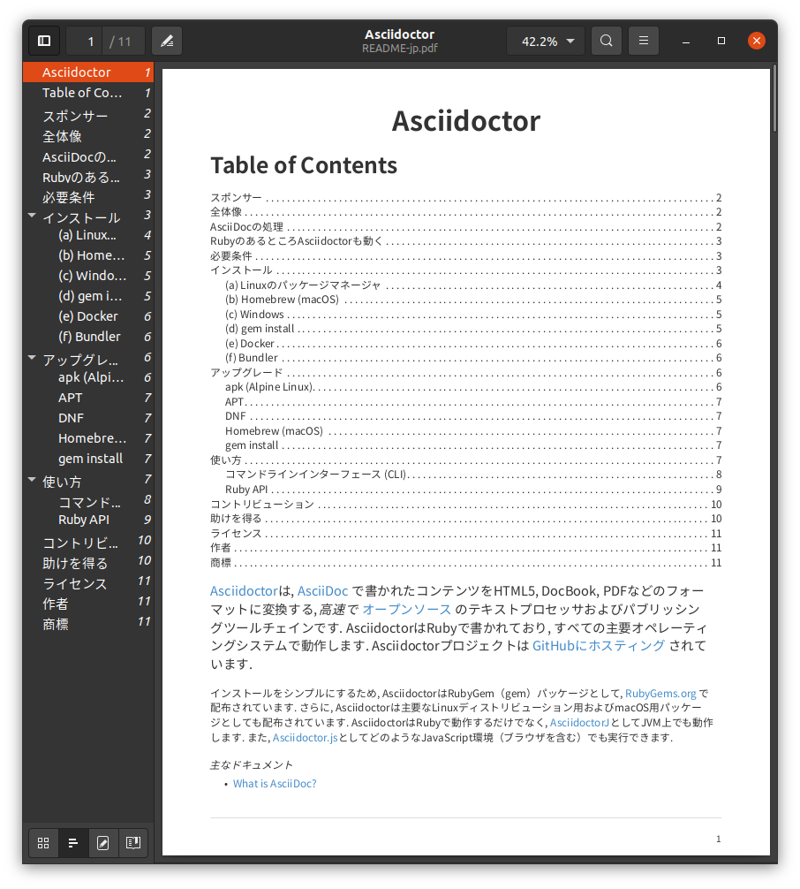|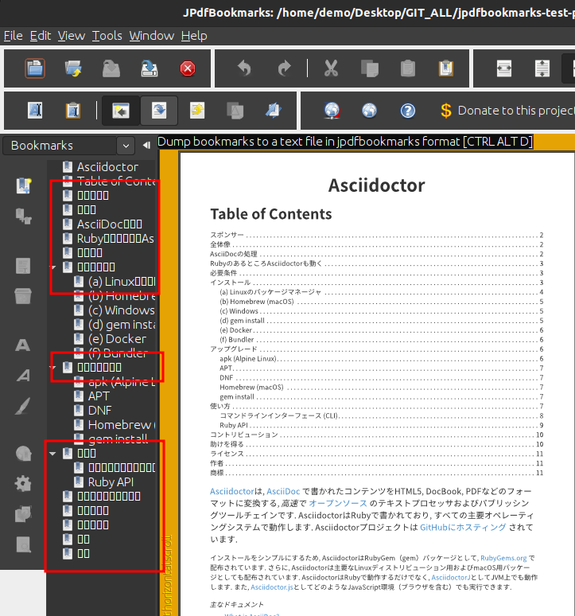
|README-zh_CN.pdf|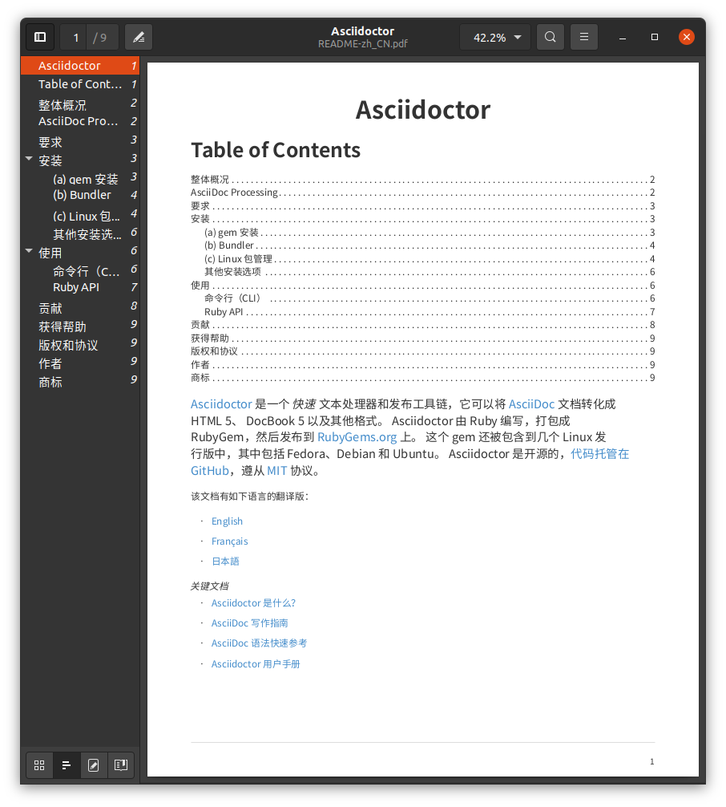|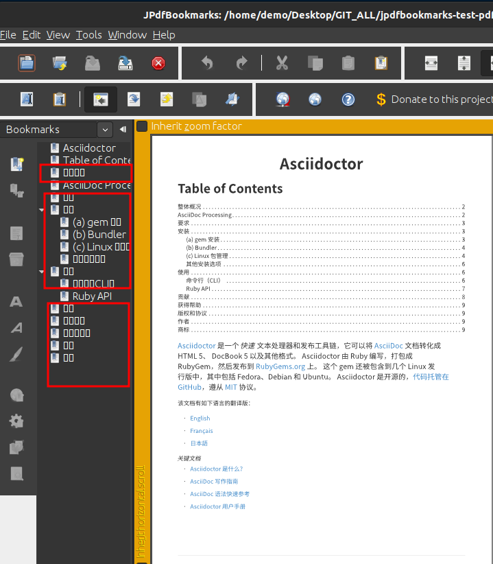
|README-zh_TW.pdf|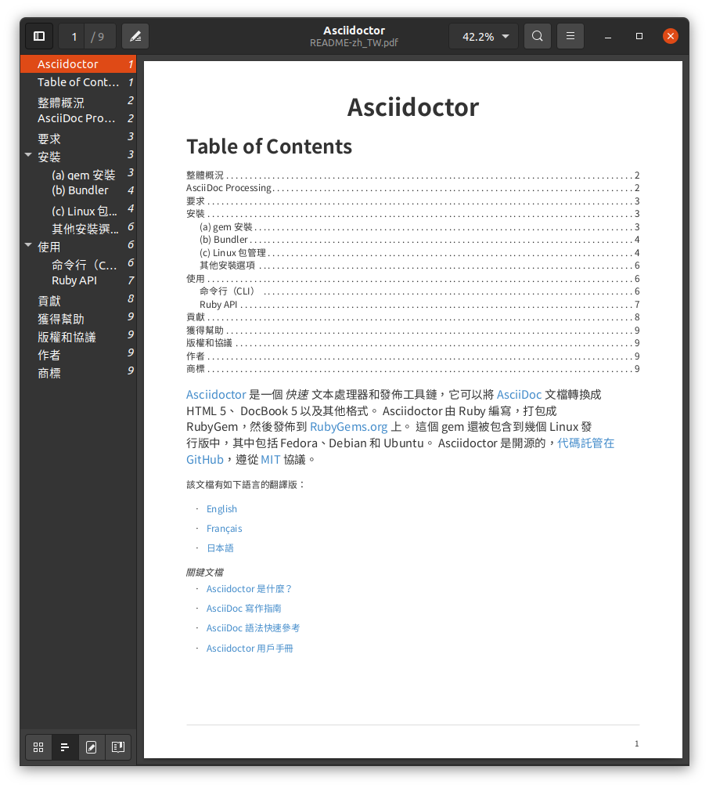|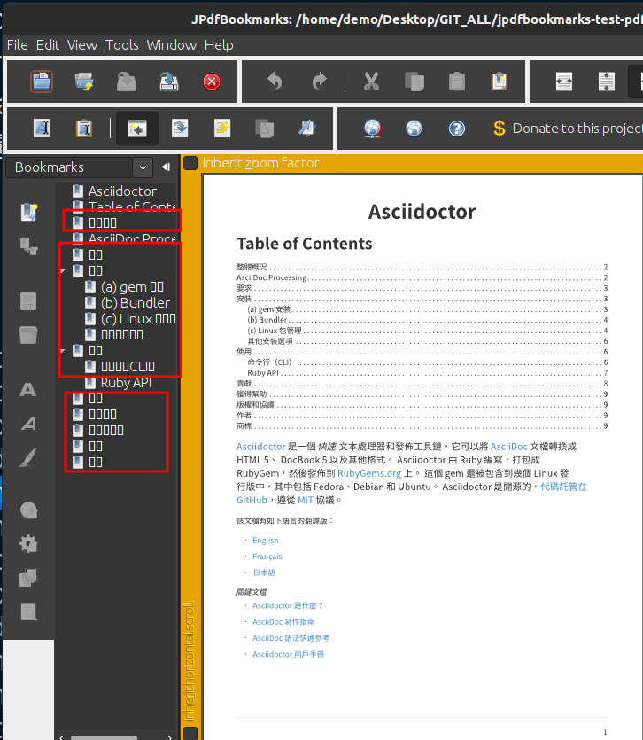
|README.pdf|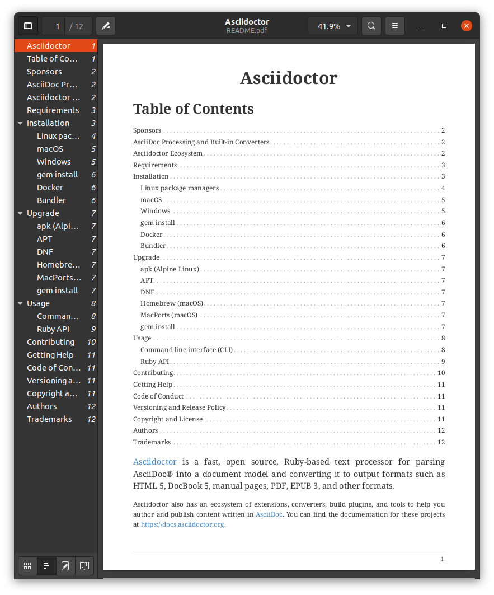|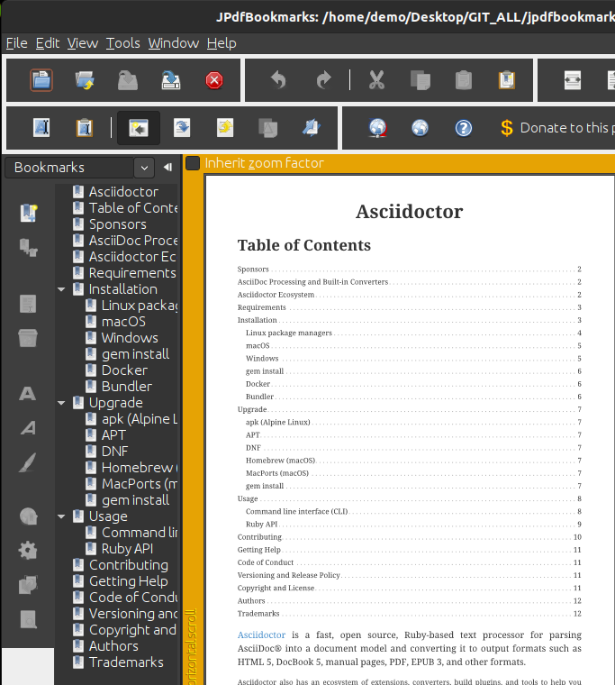
|===

.generated-docs-include / generated-docs-compress-include
[caption='{table-caption} {counter:table-number}']
[%header,cols="2,4,4"]
|===
|File Name|PDFViewer|JPdfBookmarks GUI
|README-jp.pdf||none
|README-zh_CN.pdf|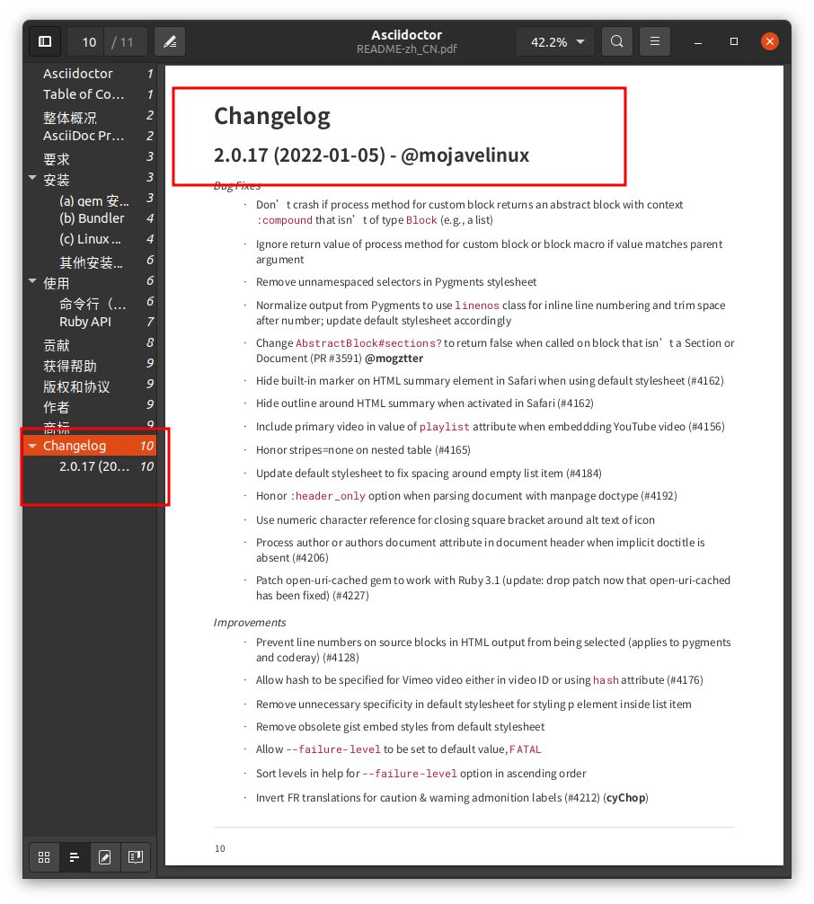|none
|README-zh_TW.pdf|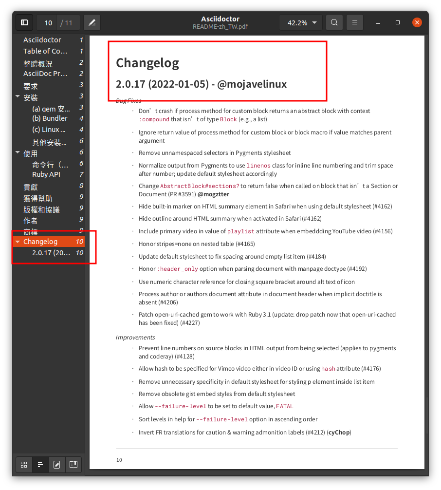|none
|README.pdf|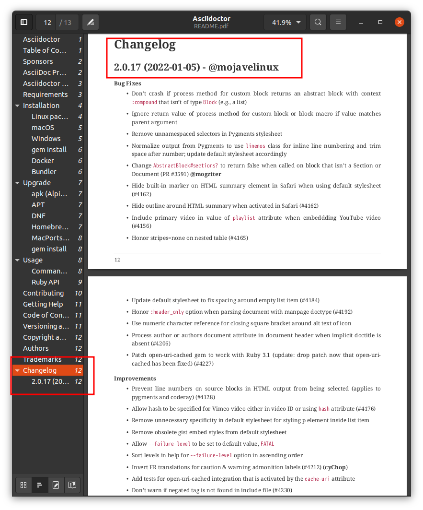|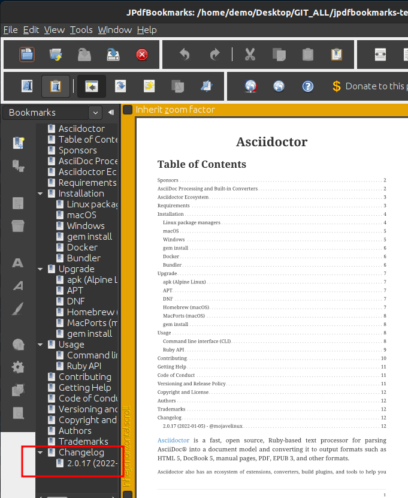
|===

